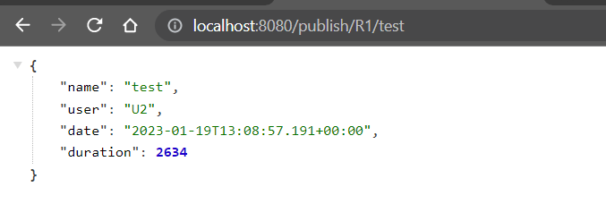
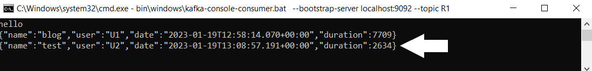
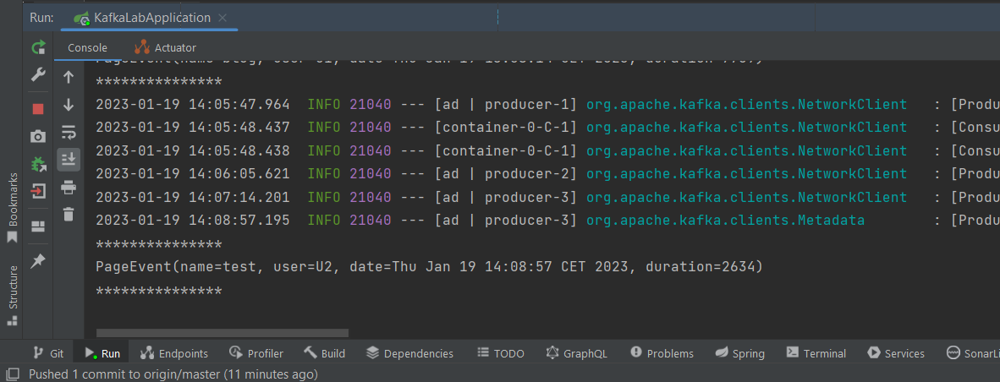
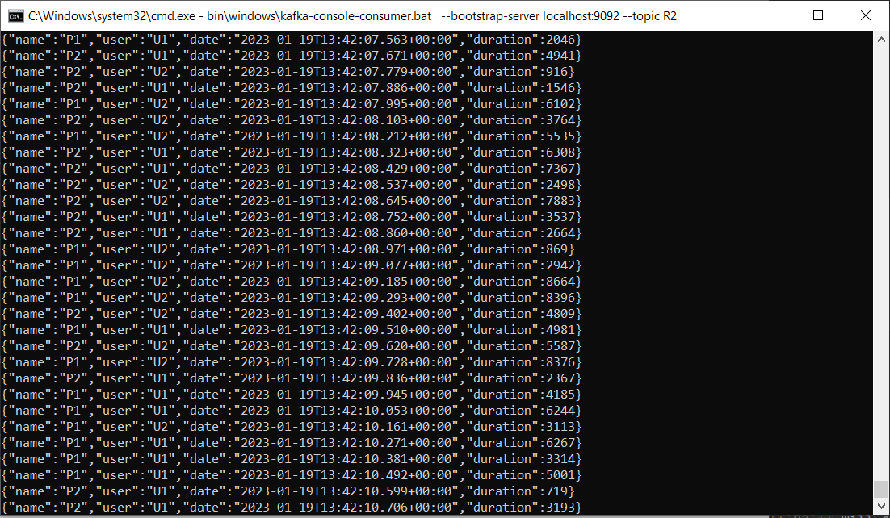

# Kafka service

## Starting kafka:
To start Kafka, here is the list of the command you need to run in your commad line:

To start the zookeeper, run the following commands:
`````
cd C:/Tools/kafka
start bin\windows\zookeeper-server-start.bat config/zookeeper.properties
`````
To start the kafka server, run the following command:
````
start bin\windows\kafka-server-start.bat config/server.properties
````

To test that everything is good and working properly, you need to start a kafka consumer and a kafka producer:
To do so, execute the following command:
````
start bin\windows\kafka-console-consumer.bat --bootstrap-server localhost:9092 --topic R1

start bin\windows\kafka-console-producer.bat --broker-list localhost:9092 --topic R1
````


## Working with kafka using Docker:

## Spring cloud streams functions:
1. Create a kafka producer via a Rest Controller:
After creating the **`PageEventRestController.java`**, add the following code:
```Java
 @Autowired
    private StreamBridge streamBridge;
    @GetMapping("/publish/{topic}/{name}")
    public PageEvent publish(@PathVariable String topic, @PathVariable String name){
        PageEvent pageEvent=new PageEvent(name,Math.random()>0.5?"U1":"U2",new Date(), new Random().nextInt(9000));
        streamBridge.send(topic,
                pageEvent);
        return pageEvent;
    }
```
To test this, type: <http://localhost:8080/publish/R1/test> on your browser to send a pageEvent object to the topic **`R1`**
This will result in the following:
    
**On your browser:**



**In kafka console consumer for the topic **`R1`****



2. Create a kafka consumer service:
- After creating **`PageEventService.java`**, add the following code:

```Java
@Bean
    public Consumer<PageEvent> pageEventConsumer(){
        return (input)->{
            System.out.println("***************");
            System.out.println(input.toString());
            System.out.println("***************");
        };
    }
```
- In **`application.properties`**, add the following configuration that sets the destination for receiving messages:
```
spring.cloud.stream.bindings.pageEventConsumer-in-0.destination=R1
spring.cloud.function.definition=pageEventConsumer;
```
To test this, type: <http://localhost:8080/publish/R1/test> on your browser to send a pageEvent object to the topic **`R1`**
This will result in the following:



3. Create a kafka supplier service:
- In **`PageEventService.java`**, add the following code:

```Java
@Bean
    public Supplier<PageEvent> pageEventSupplier(){
        return()-> new PageEvent(Math.random()>0.5?"P1":"P2",
                Math.random()>0.5?"U1":"U2",
                new Date(),
                new Random().nextInt(9000));
    }
```
This method defines a Spring Framework Bean named "pageEventSupplier" that returns a Supplier<PageEvent> object. The supplier, when invoked, creates and returns a new PageEvent object with randomly generated values for its parameters: pageName, userName, date, and randomNumber. The pageName and userName are randomly determined to be either "P1" or "P2" and "U1" or "U2" respectively. The date is set to the current date when the PageEvent object is created, and the random number is generated using the nextInt() method of the Random class with a maximum value of 9000.

- In **`application.properties`**, add the following configuration that sets the destination for receiving messages:
 
```
spring.cloud.function.definition=pageEventConsumer;pageEventSupplier;
spring.cloud.stream.bindings.pageEventSupplier-out-0.destination=R2
```
Once the application is running, this method is invoked, which means opening a kafka consumer fo the topic **`R2`** will result in:
 

 
 4. Create a function that count and renders the number of pages depending on the key value:
 - In **`PageEventService.java`**, add the following code:
 
 ```Java
 @Bean
    public  Function<KStream<String,PageEvent>,KStream<String,Long>> kStreamFunction(){
        return(input)->{
            return input.filter((k,v)->v.getDuration()>100)
                    .map((k,v)->new KeyValue<>(v.getName(),0L))
                    .groupBy((k,v)->k,Grouped.with(Serdes.String(), Serdes.Long()))
                    .count()
                    .toStream();
        };
    }
 ```
- In **`application.properties`**, add the following configuration that sets the destination for receiving messages:
 
```
spring.cloud.function.definition=pageEventConsumer;pageEventSupplier;kStreamFunction 
spring.cloud.stream.bindings.kStreamFunction-in-0.destination=R2
spring.cloud.stream.bindings.kStreamFunction-out-0.destination=R4
```
- In your command line, execute:
```
> start bin\windows\kafka-console-consumer.bat --bootstrap-server localhost:9092 --topic R2 
> start bin\windows\kafka-console-consumer.bat --bootstrap-server localhost:9092 --topic R4 --property print.key=true --property print.value=true --property key.deserializer=org.apache.kafka.common.serialization.StringDeserializer --property value.deserializer=org.apache.kafka.common.serialization.LongDeserializer
```
THis result in :
 


 
